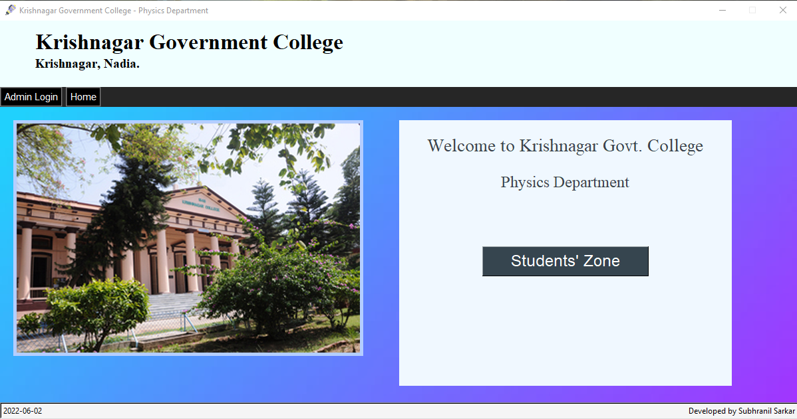
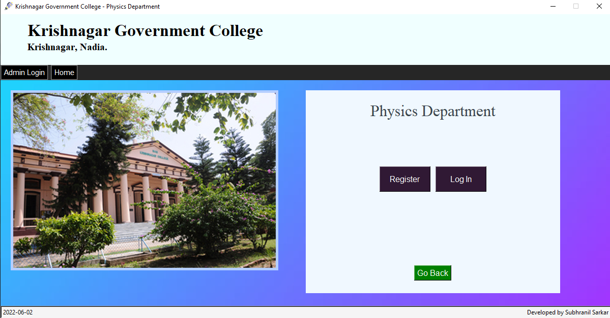
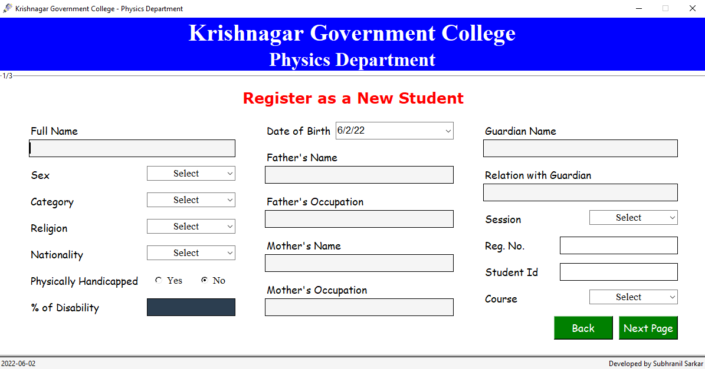
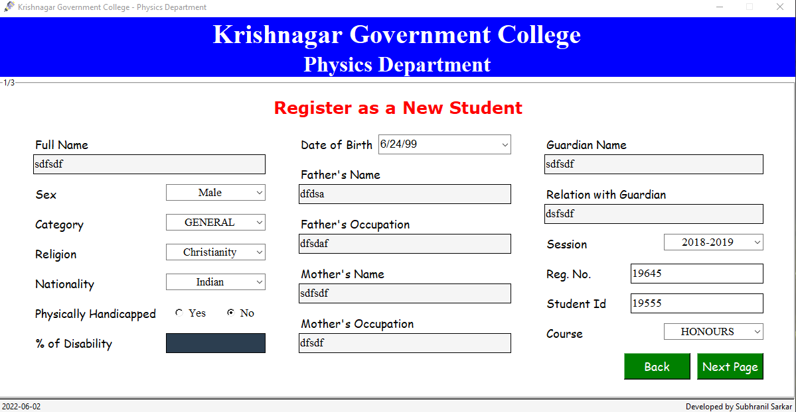
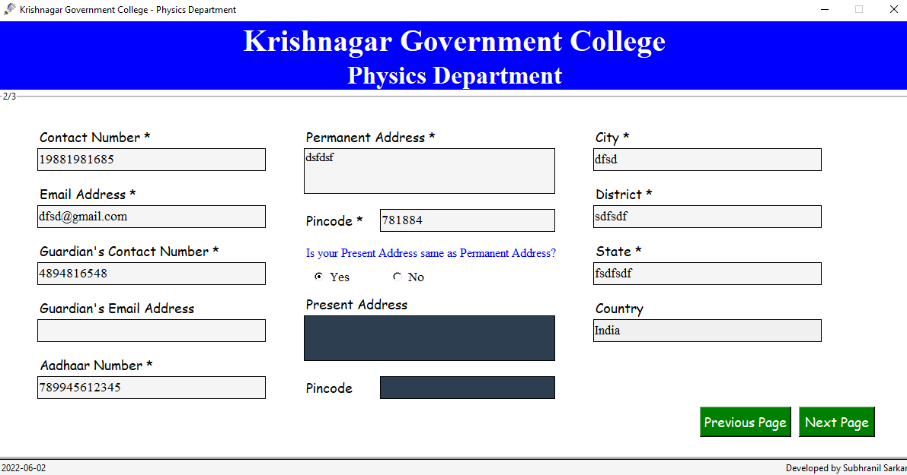
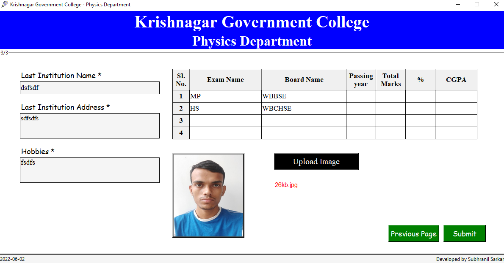
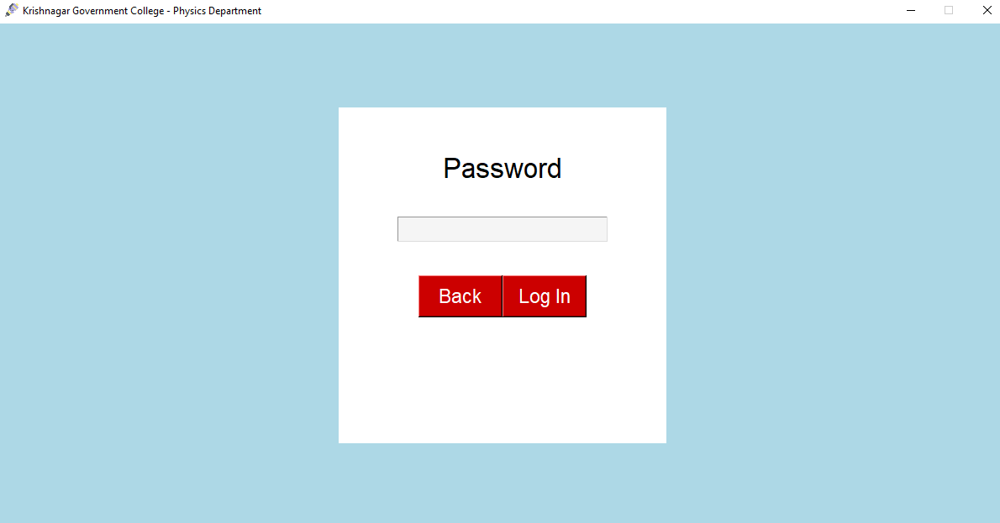
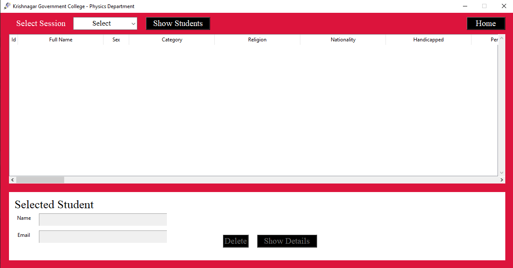
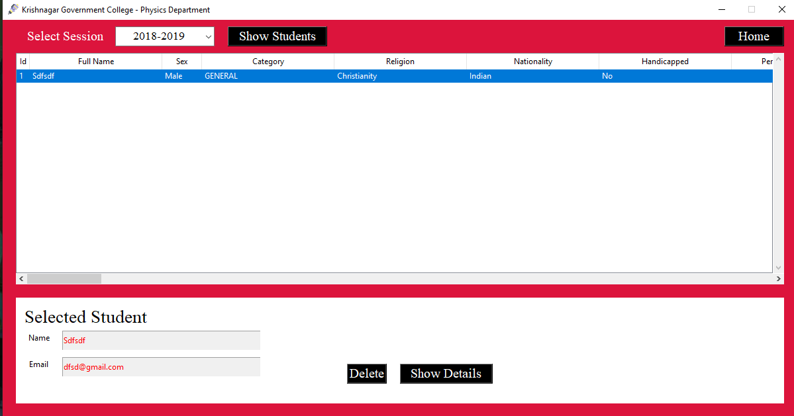

# Student_Management_GUI
It was developed for my department in my college to store student details. This was my software made using Python

1. Starting Window of the UI

2. Students' Zone

3. Register a New Student:

4. Page 1

5. Page 2

6. Page 3

7. Login Window for the Admin

8. Select Session to show the students

9. Lists the students

