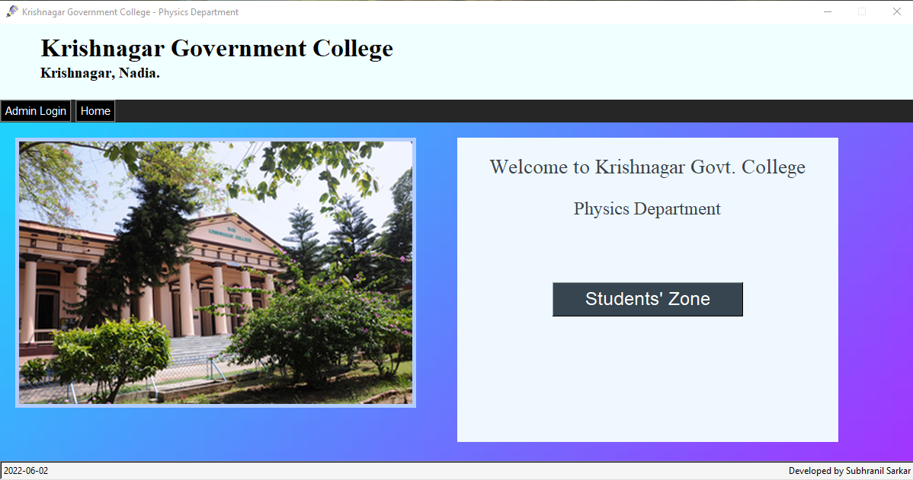
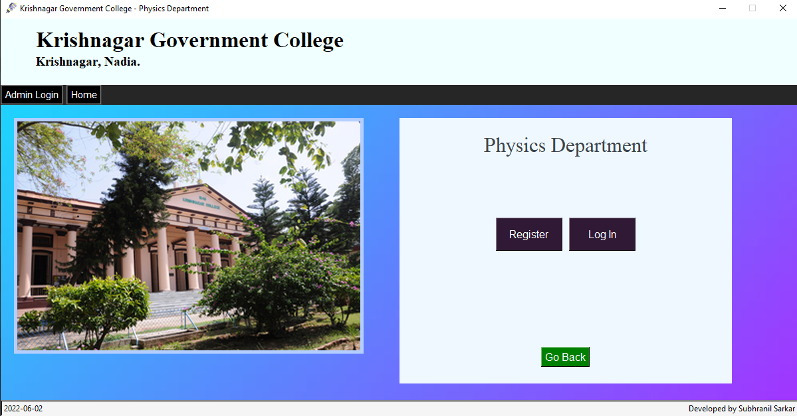
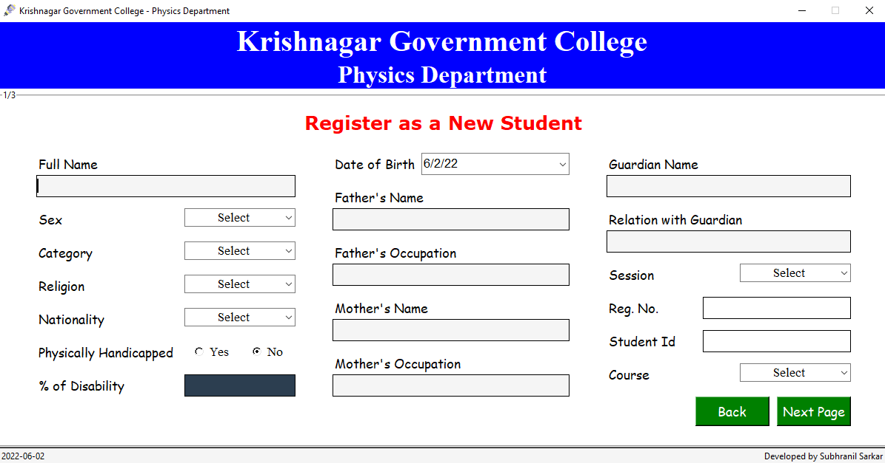
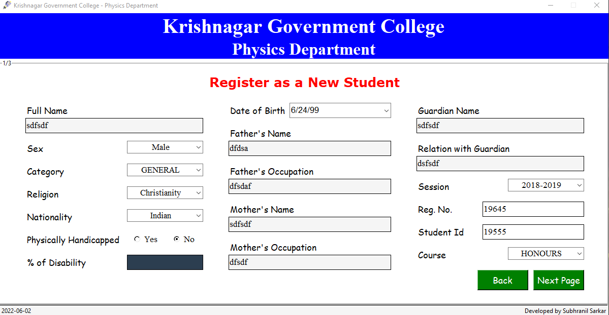
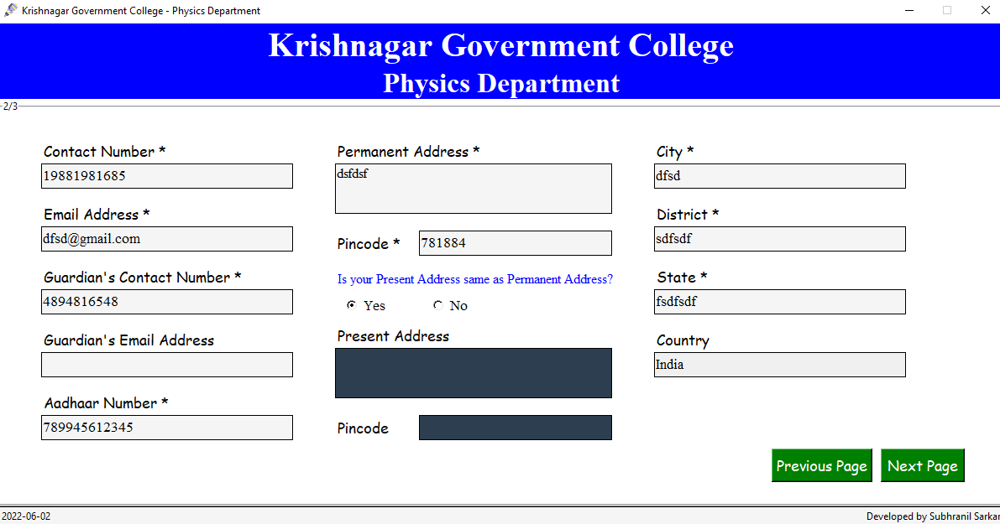
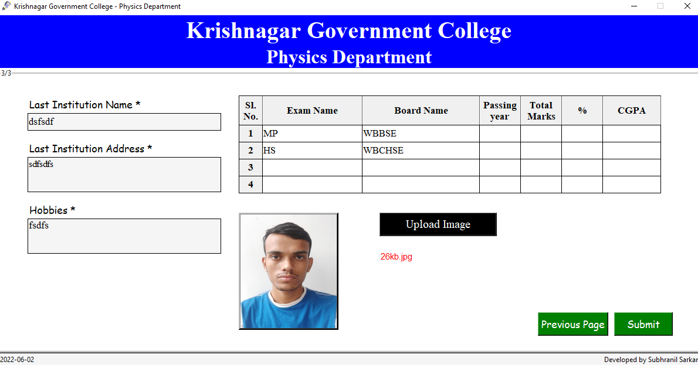
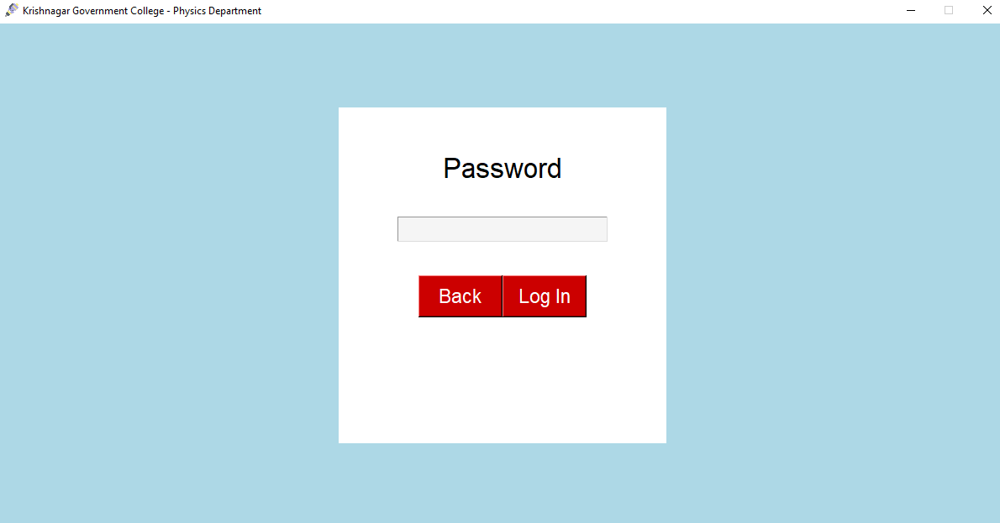
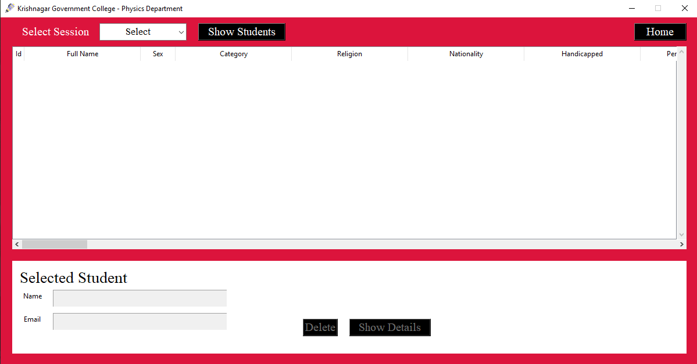
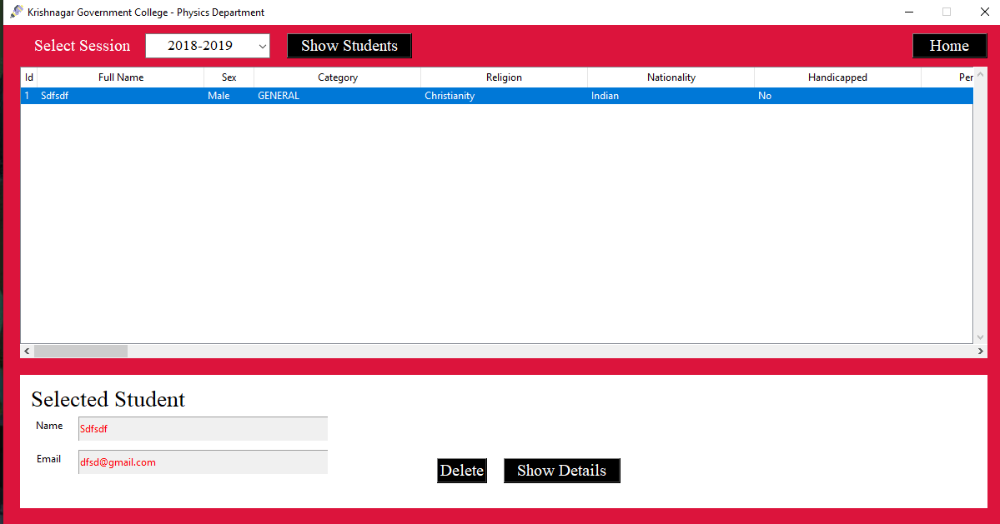

# Student Management GUI

A modern, modular student management system with a graphical user interface built with Python and Tkinter.

## Overview

This application is a refactored and modernized version of the original monolithic student management system. It features:

- **Modern Architecture**: Separated concerns with config, database, validators, services, and UI layers
- **Modular Design**: 20+ focused modules instead of one 5200-line file
- **Modern Tkinter**: Uses ttk widgets and best practices instead of classic Tk
- **Type Hints**: Full type annotations for better IDE support and error detection
- **Comprehensive Tests**: 80%+ test coverage with unit and integration tests
- **Professional Code**: Follows PEP 8, proper documentation, and clean architecture patterns

## Project Structure

```
student_management_gui/
├── src/
│   ├── config/          # Configuration and constants
│   ├── database/        # Data access layer
│   ├── validators/      # Input validation logic
│   ├── services/        # Business logic
│   ├── ui/              # User interface components
│   ├── utils/           # Utility functions
│   └── main.py          # Application entry point
├── tests/               # Comprehensive test suite
├── docs/                # Documentation
├── requirements.txt     # Python dependencies
└── setup.py            # Package configuration
```

## Features

### User Management
- User authentication and login
- Role-based access control
- Session management

### Student Management
- Student registration with comprehensive forms
- Student information search and filtering
- Profile management with photo upload
- Complete student history tracking

### Academic Records
- Marks entry and management
- CGPA calculation
- Academic performance tracking
- Grade distribution analysis

### Data Management
- SQLite database with proper schema
- Data validation and integrity checks
- Backup and recovery capabilities

## Installation

### Prerequisites
- Python 3.8+
- pip or uv package manager

### Quick Start

1. **Clone the repository**
   ```bash
   git clone https://github.com/username/student_management_gui.git
   cd student_management_gui
   ```

2. **Create virtual environment (with uv)**
   ```bash
   uv venv
   source .venv/bin/activate  # On Windows: .venv\Scripts\activate
   ```

3. **Install dependencies**
   ```bash
   uv pip install -r requirements.txt
   # Or with pip: pip install -r requirements.txt
   ```

4. **Run the application**
   ```bash
   python main.py
   ```

## Development Setup

### Install development dependencies
```bash
uv pip install -e ".[dev]"
```

### Run tests
```bash
pytest tests/ -v --cov=src --cov-report=html
```

### Code quality checks
```bash
# Linting
flake8 src tests

# Type checking
mypy src

# Code formatting
black src tests --check
```

## Configuration

### Database
- Default location: `student_mgt.db` (SQLite)
- Auto-initialized on first run
- Schema: See `docs/ARCHITECTURE.md` for details

### UI Settings
- Colors, fonts, and layout settings: `src/config/ui_config.py`
- Application constants: `src/config/settings.py`
- File upload directory: `student_photo/`

## Architecture

The application follows a layered architecture:

```
┌─────────────────────────────────────┐
│         UI Layer (ttk widgets)      │  ← User interaction
├─────────────────────────────────────┤
│       Services Layer (Business)     │  ← Business logic
├─────────────────────────────────────┤
│   Validators & Database Queries     │  ← Validation & data ops
├─────────────────────────────────────┤
│     Database & File System          │  ← Persistence
└─────────────────────────────────────┘
```

### Key Design Principles
- **Separation of Concerns**: Each layer has single responsibility
- **Dependency Injection**: Services depend on abstractions
- **Type Safety**: Full type hints for better error detection
- **Testability**: All logic easily testable in isolation
- **Reusability**: Components can be reused across application

## Database Schema

See `docs/ARCHITECTURE.md` for complete schema documentation.

### Main Tables
- `users`: User accounts and authentication
- `student_information`: Student profiles and personal details
- `student_marks`: Academic marks and grades
- `user_sessions`: Session management

## Testing

### Test Coverage
- Unit tests for validators: 95%+
- Unit tests for database: 90%+
- Unit tests for services: 85%+
- Integration tests: Full workflows
- Overall target: 80%+

### Running Tests
```bash
# All tests
pytest

# With coverage report
pytest --cov=src --cov-report=html

# Specific test file
pytest tests/test_validators.py -v

# Specific test
pytest tests/test_validators.py::TestFormValidator::test_validate_name -v
```

## Documentation

- **QUICK_START.md**: Getting started guide
- **docs/ARCHITECTURE.md**: System design and architecture
- **docs/SETUP.md**: Detailed installation instructions
- **docs/API.md**: Module API reference
- **dev_docs/IMPLEMENTATION_PLAN.md**: Implementation strategy

## Deployment

### Creating Executable (Optional)
```bash
# Using PyInstaller
pip install pyinstaller
pyinstaller --onefile --windowed --icon=icon.ico main.py
```

## Troubleshooting

### Database Connection Issues
- Ensure `student_mgt.db` is in the project root
- Check file permissions
- Run database initialization: `python -c "from src.database.db_manager import DatabaseManager; DatabaseManager.initialize()"`

### Missing Dependencies
```bash
# Reinstall all dependencies
uv pip install -r requirements.txt --force-reinstall
```

### Import Errors
- Ensure you're in the project root directory
- Check that virtual environment is activated
- Verify `src/` is properly initialized as package

## Contributing

1. Create feature branch: `git checkout -b feature/your-feature`
2. Follow PEP 8 style guide
3. Add type hints to all functions
4. Write tests for new functionality
5. Update documentation
6. Submit pull request

## License

MIT License - See LICENSE file for details

## Author

**Subhranil Sarkar**
- Email: manaspratim122@gmail.com
- GitHub: [@sarkar-subhranil](https://github.com/sarkar-subhranil)

## Changelog

### Version 2.0.0 (Current)
- Complete refactoring of monolithic codebase
- Modular architecture with clear separation of concerns
- Modern Tkinter with ttk widgets
- Comprehensive test suite
- Full type hints and documentation
- Configuration externalization

### Version 1.0.0
- Initial monolithic application
- Basic student management features
- Classic Tk GUI

## Acknowledgments

This refactoring follows industry best practices and modern Python design patterns, transforming the original 5200-line monolithic application into a maintainable, testable, and professional codebase.

---

**Status**: Phase 1-2 Complete (Infrastructure & Configuration)  
**Last Updated**: 2026-06-10  
**Next Steps**: Continue with Phase 3 (Database Layer)

## Screenshots

1. Starting Window of the UI


2. Students' Zone


3. Register a New Student


4. Page 1


5. Page 2


6. Page 3


7. Login Window for the Admin


8. Select Session to show the students


9. Lists the students

